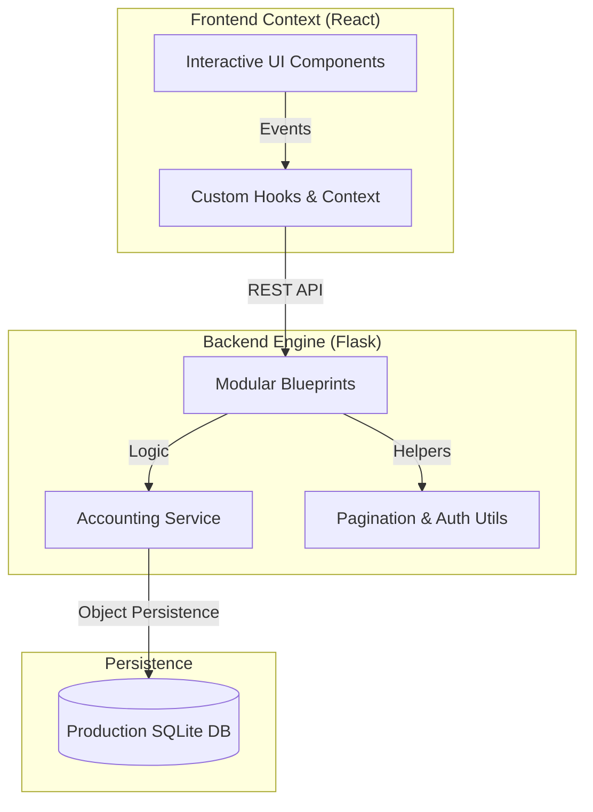
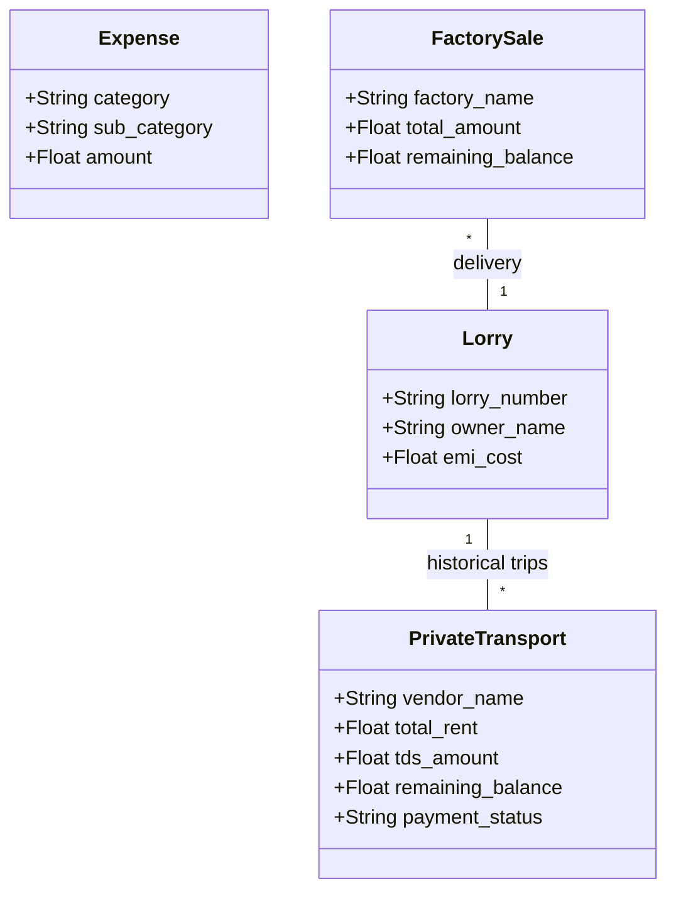
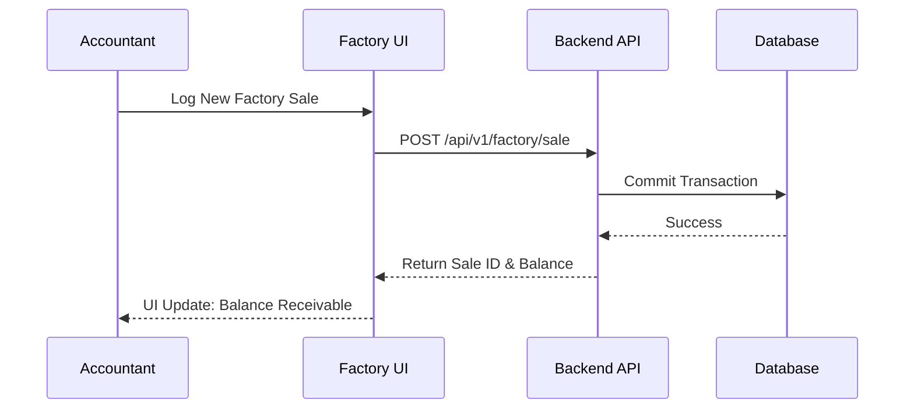

# GVK Transport Management System v2.0 🚛

[](https://github.com/PAMIDIROHIT/gvk-transport-/actions/workflows/main.yml)
[](./docker-compose.yml)
[](package.json)

A high-performance, enterprise-grade logistics and accounting platform designed to streamline transport operations, mine procurement, and factory sales. Built with a focus on precision accounting, real-time analytics, and a premium "Dark Mode" aesthetic.

---

## �️ System Architecture

The GVK Transport Management System is engineered using a **decoupled Client-Server architecture**, designed for high scalability, maintainability, and clear separation of concerns.

### 1. Presentation Layer (Frontend)
- **Framework**: React v19 (Functional Components & Hooks).
- **State Management**: Built-in Context API for Authentication and local state hooks for real-time calculation updates.
- **Styling Strategy**: Utility-first CSS via **Tailwind CSS**, ensuring a responsive, high-fidelity dark-mode interface.
- **Data Fetching**: Asynchronous logic using the `Fetch API`, integrated with custom React Hooks to handle loading and synchronized data states.

### 2. Application Layer (Backend API)
- **Engine**: Python 3.11 with the **Flask** framework.
- **Modular Design**: Implements a **Blueprint-based Architecture**. Each business module (Lorry, Expense, Mine, Factory) is isolated, making the system easy to extend.
- **Accounting Engine**: Custom logic for financial validation, including TDS calculations, fuel mileage analysis, and net-payout logic.
- **Security**: CORS-enabled communication with environment-based configuration for production isolation.

### 3. Data Layer (Persistence)
- **ORM**: **SQLAlchemy** (Object Relational Mapper) provides a human-readable abstraction over complex SQL queries.
- **Storage**: **SQLite** (v3) for high-speed, local reliability (can be easily migrated to PostgreSQL/MySQL via SQLAlchemy config).
- **Integrity**: Transactional commits ensure that accounting records (like factory sales and balances) remain consistent even during network interruptions.

### 4. System Flow & Integration


---

## 🌟 Key Features

### 💎 Enterprise Logistics
- **Three-Tier Fleet Management**: Advanced tracking for Own Fleet, Master Rented Lorries, and Payout Registries.
- **Accurate Payout Engine**: Automatic calculation of TDS, diesel advances, cash advances, and shortage deductions.
- **Universal Search & Pagination**: Scalable data handling across all modules using a generic backend pagination engine.

### 💰 Accounting & Financials
- **Procurement Ledger**: Real-time tracking of mine extractions with loading and transport hire integration.
- **Factory Sales Logic**: Comprehensive sales management with credit/debit tracking and balance recovery.
- **Expense Categorization**: Separate workflows for Business, Personal, and Loan/EMI liabilities.

---

## 🏗️ Technical Deep Dive

### Data Model Logic
The system maintains relational integrity across logistical and financial entities.



### Business Logic Flow
Example: The "Factory Sale to Payout" workflow.



---

## 🚀 Deployment & Installation

### Option 1: Docker (Recommended)
```bash
# Clone the repository
git clone https://github.com/PAMIDIROHIT/gvk-transport-.git
cd gvk-transport-

# Build and Start the services
docker-compose up --build
```
Access the app at `http://localhost:80` (Frontend) and `http://localhost:5000` (API).

---

## 👤 Author
**PAMIDI ROHIT**
- GitHub: [@PAMIDIROHIT](https://github.com/PAMIDIROHIT)
- "Elevating logistical operations through intelligent software."

---
*Note: This project was developed as a production-grade solution for GVK Transport Management.*
