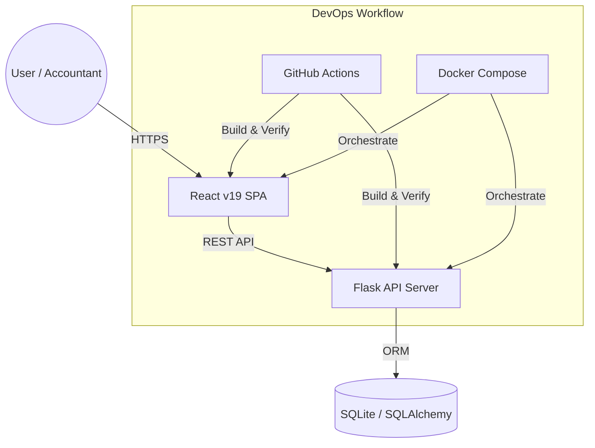
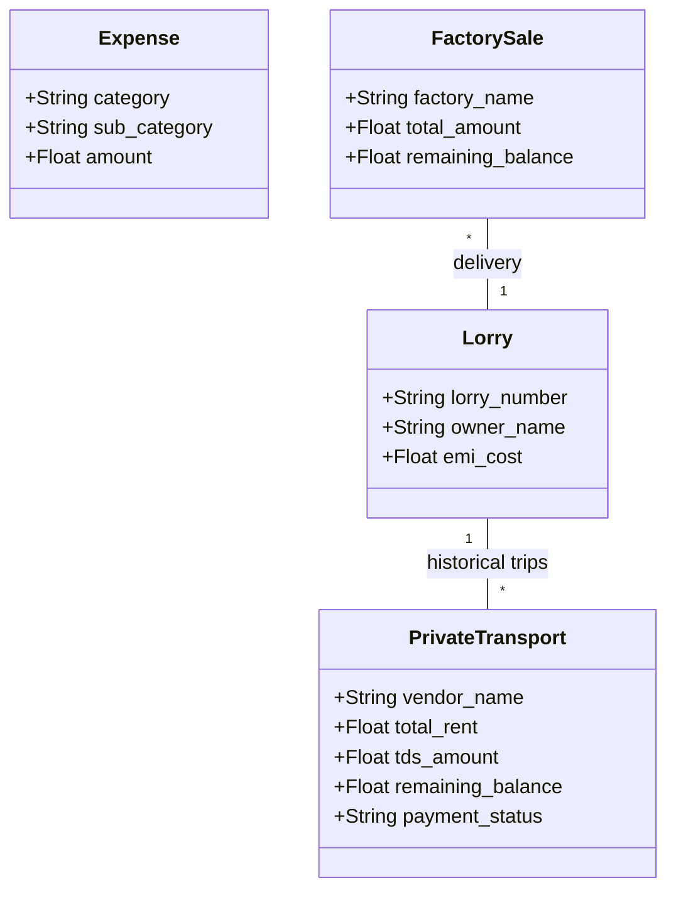
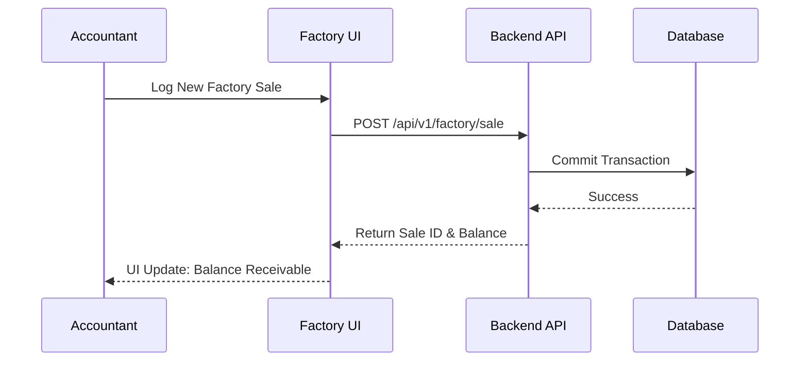

# GVK Transport Management System v2.0 🚛

[](https://github.com/PAMIDIROHIT/gvk-transport-/actions/workflows/main.yml)
[](./docker-compose.yml)
[](package.json)

A high-performance, enterprise-grade logistics and accounting platform designed to streamline transport operations, mine procurement, and factory sales. Built with a focus on precision accounting, real-time analytics, and a premium "Dark Mode" aesthetic.

---

## 🌟 Key Features

### 💎 Enterprise Logistics
- **Three-Tier Fleet Management**: Advanced tracking for Own Fleet, Master Rented Lorries, and Payout Registries.
- **Accurate Payout Engine**: Automatic calculation of TDS, diesel advances, cash advances, and shortage deductions.
- **Universal Search & Pagination**: Scalable data handling across all modules using a generic backend pagination engine.

### 💰 Accounting & Financials
- **Procurement Ledger**: Real-time tracking of mine extractions with loading and transport hire integration.
- **Factory Sales Logic**: Comprehensive sales management with credit/debit tracking and balance recovery.
- **Expense Categorization**: Separate workflows for Business, Personal, and Loan/EMI liabilities.

### 📊 Intelligence
- **Audit Filters**: Quick monthly and date-range filtering for financial compliance.
- **Dashboard Metrics**: Real-time aggregation of net margins, receivable accounts, and operation expenses.

---

## 🏗️ System Architecture

### Component Overview
The system follows a modern decoupled architecture with a Python/Flask REST API and a React/Vite SPA.



### Data Model (UML Class Diagram)
Our models are designed for relational integrity and financial traceability.



### Business Logic Flow (Sequence Diagram)
Example: The "Factory Sale to Payout" workflow.



---

## 🚀 Deployment & Installation

### Option 1: Docker (Recommended)
Ensure you have Docker and Docker Compose installed.

```bash
# Clone the repository
git clone https://github.com/PAMIDIROHIT/gvk-transport-.git
cd gvk-transport-

# Build and Start the services
docker-compose up --build
```
Access the app at `http://localhost:80` (Frontend) and `http://localhost:5000` (API).

### Option 2: Build from Source

#### Backend
```bash
cd backend
python -m venv venv
source venv/bin/activate # or venv\Scripts\activate on Windows
pip install -r requirements.txt
python app.py
```

#### Frontend
```bash
cd frontend
npm install
npm run dev
```

---

## 🛠️ Tech Stack & DevOps
- **Frontend**: React 19, Vite, Lucide React, Tailwind CSS.
- **Backend**: Python 3.11, Flask, SQLAlchemy, Marshmallow.
- **DevOps**: Docker, Docker Compose, GitHub Actions (CI/CD).
- **Architecture**: Modular Blueprint-based Flask structure, Single Responsibility components.

---

## 👤 Author
**PAMIDI ROHIT**
- GitHub: [@PAMIDIROHIT](https://github.com/PAMIDIROHIT)
- "Elevating logistical operations through intelligent software."

---
*Note: This project was developed as a production-grade solution for GVK Transport Management.*
